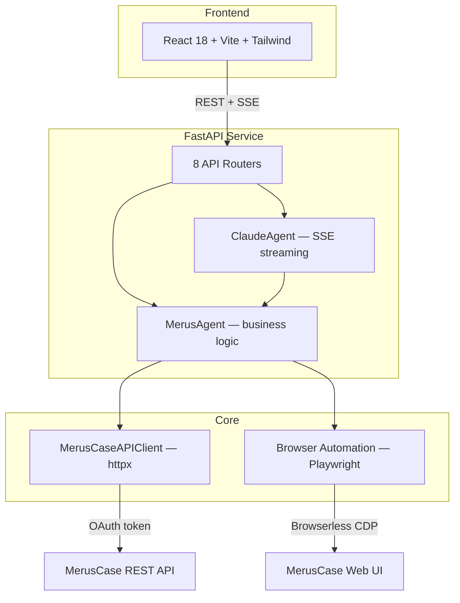

# Merus Expert

**Natural language MerusCase integration platform — AI agent, REST API, browser automation.**

Version 2.0.0 · [Swagger UI →](http://localhost:8000/docs)

---

## What It Does

Merus Expert is a full-stack platform for interacting with [MerusCase](https://meruscase.com) legal case management. It provides two modes:

- **AI Agent Chat** — Ask questions in plain English: "What's the billing total for the Smith case?" Claude AI uses 13 tools to search cases, pull billing, add time entries, upload documents, and more — all streamed via SSE.
- **Matter Creation Wizard** — Guided conversational UI that collects case details step-by-step and submits new matters via browser automation (MerusCase has no case-creation API).

**Capabilities:** Case search, case details, billing entries, time billing, cost entries, activity notes, document upload, party lookup, billing codes, activity types — all accessible through the REST API, AI agent, or React frontend.

---

## Architecture



**Four layers:**
1. **Frontend** — React SPA with chat interface and matter wizard
2. **FastAPI Service** — HTTP API with authentication, routing, and service logic
3. **Core** — MerusAgent (high-level operations + caching) and ClaudeAgent (AI tool-use loop)
4. **External** — MerusCase REST API (via OAuth) and MerusCase Web UI (via browser automation)

---

## Tech Stack

| Layer | Technology |
|-------|------------|
| **Language** | Python 3.12, TypeScript |
| **Backend** | FastAPI, uvicorn, sse-starlette |
| **AI Agent** | Anthropic Claude (tool-use), Google Gemini (NLP parsing) |
| **API Client** | httpx (async HTTP) |
| **Frontend** | React 18, Vite, Tailwind CSS, Zustand |
| **Browser** | Playwright, Browserless (cloud headless) |
| **Database** | SQLite |
| **Models** | Pydantic v2 |
| **Security** | SOC2 audit logging, API key auth, GCP Secret Manager |
| **Container** | Docker multi-stage build |

---

## Quick Start

### Option A: Docker (recommended)

```bash
cp .env.example .env
# Fill in required values: ANTHROPIC_API_KEY, MERUS_API_KEY, MERUSCASE_ACCESS_TOKEN

docker compose up --build
# Backend: http://localhost:8000
# Frontend: served from backend at http://localhost:8000
# Swagger: http://localhost:8000/docs
```

### Option B: Local Development

**Terminal 1 — Backend:**
```bash
pip install -e ".[dev]"
python main.py init-db
uvicorn service.main:app --reload --port 8000
```

**Terminal 2 — Frontend:**
```bash
cd frontend
npm install
npm run dev
# Frontend: http://localhost:3000 (proxied to backend)
```

### Prerequisites

- Python 3.12+
- Node.js 20+
- A MerusCase OAuth token (see [OAuth Guide](docs/OAUTH_GUIDE.md))
- An Anthropic API key (for AI agent features)

---

## API Overview

All API routes require `X-API-Key` header authentication (except `/health`).

| Router | Prefix | Key Endpoints | Description |
|--------|--------|---------------|-------------|
| **health** | `/health` | `GET /health` | Health check (no auth) |
| **cases** | `/api` | `GET /cases/search`, `GET /cases/{id}`, `GET /cases/{id}/billing`, `GET /cases/{id}/parties` | Case search and details |
| **billing** | `/api` | `POST /billing/time`, `POST /billing/cost`, `POST /billing/time/bulk` | Time billing and cost entries |
| **activities** | `/api/activities` | `POST /note` | Non-billable notes |
| **reference** | `/api/reference` | `GET /billing-codes`, `GET /activity-types` | Cached reference data |
| **agent** | `/api/agent` | `POST /chat` (SSE) | Claude AI agent — streaming |
| **chat** | `/api/chat` | `POST /session`, `POST /message`, `GET /history` | Matter wizard conversations |
| **matter** | `/api/matter` | `POST /preview`, `POST /submit` | Matter creation (browser automation) |

Interactive documentation: **[Swagger UI](http://localhost:8000/docs)** (available when service is running).

---

## AI Agent

The Claude AI agent provides a natural language interface to MerusCase with **13 tools**:

| Tool | Operation |
|------|-----------|
| `find_case` | Fuzzy search by file number or party name |
| `get_case_details` | Full case details by ID |
| `get_case_billing` | Billing/ledger entries with date filters |
| `get_case_activities` | Activities and notes |
| `get_case_parties` | Parties and contacts |
| `list_cases` | List cases with status/type filters |
| `get_billing_summary` | Billing totals for a case |
| `bill_time` | Create billable time entry |
| `add_cost` | Add cost/fee/expense entry |
| `add_note` | Add non-billable note |
| `upload_document` | Upload file to a case |
| `get_billing_codes` | Available billing codes (cached) |
| `get_activity_types` | Available activity types (cached) |

The agent streams responses via SSE with events for text, tool calls, tool results, and errors.

For full details: **[Agent Documentation](docs/AGENT_DOCUMENTATION.md)**

---

## OAuth Token Setup

The service needs an OAuth access token to communicate with the MerusCase API. See the complete guide: **[OAuth Guide](docs/OAUTH_GUIDE.md)**

**Quick version:**
```bash
# 1. Add OAuth app credentials to .env
# 2. Run the automated flow
python oauth_browser_flow.py
# Token saved to .meruscase_token — service reads it automatically
```

---

## Configuration

Key environment variables (see [`.env.example`](.env.example) for the complete list with defaults):

| Variable | Required | Description |
|----------|----------|-------------|
| `ANTHROPIC_API_KEY` | Yes | Claude API key for AI agent |
| `MERUS_API_KEY` | Yes | REST API authentication key |
| `MERUSCASE_ACCESS_TOKEN` | Yes* | OAuth token (*or use `.meruscase_token` file) |
| `PORT` | No | Service port (default: 8000) |
| `CORS_ORIGINS` | No | Allowed origins (default: localhost) |
| `CACHE_TTL_SECONDS` | No | Reference data cache (default: 3600) |
| `DB_PATH` | No | SQLite path (default: `./knowledge/db/merus_knowledge.db`) |
| `LOG_LEVEL` | No | Logging level (default: INFO) |

For browser automation (matter creation), also set: `MERUSCASE_EMAIL`, `MERUSCASE_PASSWORD`, `BROWSERLESS_API_TOKEN`.

---

## Project Structure

```
merus-expert/
├── src/merus_expert/          # Core package (agent, API client, automation)
│   ├── agent/                 # Claude AI agent + 13 tools
│   ├── api_client/            # MerusCase REST API client (httpx)
│   ├── core/                  # MerusAgent — business logic layer
│   ├── automation/            # Browser-based matter creation
│   ├── batch/                 # Bulk import operations
│   ├── browser/               # Browserless/Playwright clients
│   ├── models/                # Pydantic data models
│   ├── persistence/           # SQLite session/matter/audit stores
│   └── security/              # SecurityConfig, audit logging
├── service/                   # FastAPI HTTP service
│   ├── routes/                # 8 API routers
│   ├── models/                # Request/response schemas
│   └── services/              # Conversation flow, billing, NLP
├── frontend/                  # React 18 + Vite + Tailwind SPA
│   └── src/                   # Components, hooks, stores, router
├── integrations/              # Spectacles client
├── knowledge/                 # SQLite DB files
├── tests/                     # pytest unit + integration tests
├── docs/                      # Documentation
├── Dockerfile                 # Multi-stage build
├── docker-compose.yml
└── pyproject.toml             # Package config (v2.0.0)
```

---

## Docker & Deployment

> **Canonical source: this monorepo** (`gbs-tools-and-resources`). Cloud Build trigger deploys from `packages/merus-expert/` → Cloud Run. The standalone `Glass-Box-Solutions-Inc/merus-expert` repo is archived. See [`DEPLOYMENT_MODEL.md`](../../DEPLOYMENT_MODEL.md) for details.

### Build & Run

```bash
# Build multi-stage image (frontend → Python wheel → runtime)
docker build -t merus-expert .

# Run with env vars
docker run -p 8000:8000 --env-file .env merus-expert
```

### Cloud Run Deployment

```bash
# Build and push
gcloud builds submit --tag gcr.io/YOUR_PROJECT/merus-expert

# Deploy
gcloud run deploy merus-expert \
  --image gcr.io/YOUR_PROJECT/merus-expert \
  --port 8000 \
  --region us-central1 \
  --set-secrets=ANTHROPIC_API_KEY=anthropic-api-key:latest,MERUSCASE_ACCESS_TOKEN=meruscase-oauth-token:latest
```

---

## SOC2 Compliance

- **Audit logging** — All operations logged with event ID, timestamp, session ID. 90-day retention with automated cleanup.
- **Session management** — 30-minute inactivity timeout, 8-hour maximum duration.
- **Screenshot retention** — 24-hour auto-cleanup for browser automation screenshots.
- **Audit categories** — AUTHENTICATION, MATTER_OPERATIONS, CREDENTIAL_ACCESS, BROWSER_AUTOMATION, SECURITY_EVENTS.
- **Non-root container** — Docker image runs as unprivileged user.
- **Secret management** — GCP Secret Manager integration for production credentials.

---

## Troubleshooting

| Issue | Solution |
|-------|----------|
| `401 Unauthorized` from MerusCase API | OAuth token expired — re-run `python oauth_browser_flow.py` ([OAuth Guide](docs/OAUTH_GUIDE.md)) |
| `KeyError: 'ANTHROPIC_API_KEY'` | Add `ANTHROPIC_API_KEY` to `.env` |
| Browser automation fails | Check `BROWSERLESS_API_TOKEN`. Run `python main.py test-browser`. |
| Database errors | Run `python main.py init-db` to initialize schema |
| CORS errors in frontend | Verify `CORS_ORIGINS` includes your frontend URL |
| `ModuleNotFoundError: merus_expert` | Run `pip install -e ".[dev]"` for editable install |
| Frontend build fails | Run `cd frontend && npm install` |
| Service won't start | Check `.env` has all required vars. Run `uvicorn service.main:app` to see errors. |

---

## Documentation

| Document | Description |
|----------|-------------|
| [Agent Documentation](docs/AGENT_DOCUMENTATION.md) | Full AI agent reference — tools, streaming, system prompt |
| [Developer Quick Start](docs/DEVELOPER_QUICKSTART.md) | Local development setup guide |
| [OAuth Guide](docs/OAUTH_GUIDE.md) | OAuth token lifecycle — acquisition, storage, renewal |
| [MerusCase API Guide](docs/MERUSCASE_API_DEVELOPER_GUIDE.md) | Raw MerusCase API reference |
| [Swagger UI](http://localhost:8000/docs) | Interactive API documentation (live) |

---

## License

Proprietary — Glass Box Solutions, Inc.

---

@Developed & Documented by Glass Box Solutions, Inc. using human ingenuity and modern technology
