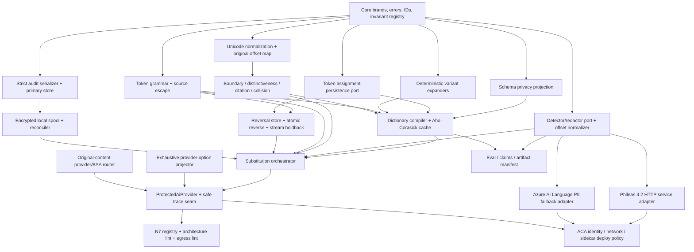

# Phase-1 module dependency graph

The Phileas boundary isolates JVM work from the deterministic TypeScript core. Arrows mean “must have a frozen port/shape before integration,” not necessarily that implementation must wait.



## Safe parallel spark work

Once `core/brands.ts`, `core/contracts.ts`, and the detector wire DTOs are frozen, these tracks can start independently:

| Parallel track | Modules | Why it is isolated | Merge prerequisites |
|---|---|---|---|
| A | Schema privacy projector and classification snapshot | Pure schema/CI projection; no matcher or provider dependencies. | Core IDs/field shapes. |
| B | Deterministic variant expanders | Pure functions with golden fixtures. | Tagged-value and token brands. |
| C | Unicode normalizer, boundaries, distinctiveness, citation parser, collision resolver | Operates on candidates/spans; fake candidates suffice. | Offset/candidate shapes and class precedence. |
| D | Token grammar, reserved-literal escape, token assignment adapter | Independent of detector and provider SDK. | Role allow-list and persistence identity. |
| E | Reversal store adapter, atomic reverse, UTF-16 stream holdback | Can use fake handles/store and exhaustive chunks. | Token grammar and bounded lookup port; implementation can begin with a stub grammar. |
| F | Strict audit serializer, primary outbox adapter | Counts/IDs only; no substitution content dependency. | Audit event/prepared shapes. |
| G | AES-256-GCM local spool, key adapter, drain/reconciler | Independent sensitive subsystem with fake primary store. | Prepared/final audit shapes and idempotency key. |
| H | Detector/redactor offset normalizer and deadline/failover runner | Vendor-neutral, testable with fake raw spans. | Detector/redactor port and identifier mapping. |
| I | Phileas 4.2 thin JVM service and TypeScript HTTP adapter | Lives behind the port; can use wire fixtures. | Frozen wire DTOs, artifact identity, ACA constraints. |
| J | Azure AI Language PII adapter | Independent fallback behind the same port. | Frozen wire/port and approved SDK/config. |
| K | Exhaustive Glassy provider-option projector | Product-specific structural work with fake tokenized segments. | `TextSegment`/`TokenizedTextSegment` shapes. |
| L | Original-content provider/BAA router adapter | Must preserve current safety gates but does not depend on substitution internals. | Router return shape and current provider inventory. |
| M | N7 registry, architecture rules, egress lint | Static product analysis; can inventory while core is built. | Approved provider/private-module boundaries and carve-out schema. |
| N | Evaluation scorer, Wilson gates, claims/artifact manifest | Uses synthetic manifests and fake engine outputs. | Identifier taxonomy and thresholds. |
| O | ACA deployment policy: identities, network rules, sidecar probes/resources, no-body-logging tests | Infrastructure work can use placeholder images. | Final service names/ports before promotion. |

## Serialized integration chain

These edges should not be implemented as competing interpretations:

1. **Token assignment + variants + collision → dictionary compiler/cache.** The compiler must consume the frozen outputs of Tracks B–D. It cannot invent its own normalization or token identity.
2. **Dictionary compiler + detector normalizer + reversal + audit/spool → substitution orchestrator.** Only one module merges dictionary and detector spans and applies L12 precedence.
3. **Options projector + original-content router + orchestrator → `ProtectedAiProvider`.** Routing occurs on original content; provider invocation happens only after audit durability.
4. **Protected provider + N7 product gates + ACA deploy policy → Glassy cutover.** A wrapper unit test alone does not prove total egress coverage.
5. **Pinned sidecar/provider/package artifacts + full corpus/perf/mutations → claims eligibility.** Evidence is produced after integration, never inferred from component status.

## Coordination hazards

- Tracks C and H both work with offsets. C owns original Unicode normalization for dictionary candidates; H owns vendor offset conversion/validation. They share types but not implementations.
- Tracks D and E share token grammar. E may begin with a fake, but the final exhaustive streaming suite must use Track D's real grammar and maximum length.
- Tracks F and G both persist audit state. F owns canonical plaintext validation; G owns encrypted-at-rest fallback. The spool may not define a second event schema.
- Track I may expose Phileas FPE, but Track D remains the N5 token authority. No JVM response may install or serialize a complete reversal map.
- Track K must freeze against Glassy's real `AiProvider` option union. Core cannot guess unknown provider fields.
- Track M must run in each consumer repository. Publishing the shared package does not enforce imports, raw fetches, or network identity there.

## Critical path

```text
core shapes
  → token/variant/collision contracts
  → dictionary compiler
  → substitution orchestrator
  → ProtectedAiProvider integration
  → N7 product cutover
  → full mutation + ACA performance/deploy evidence
```

The Phileas sidecar and audit spool are parallel critical-risk tracks. Either can block provider egress at integration, so both should start with the first spark wave even though neither blocks the pure dictionary modules from being built.
