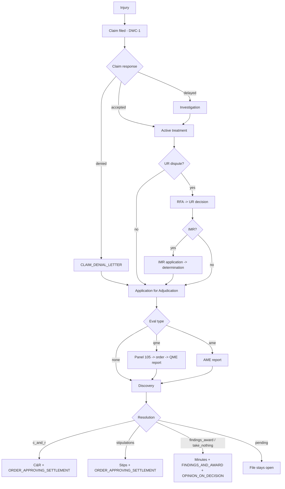
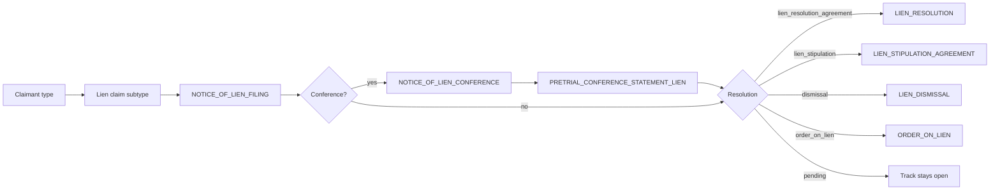
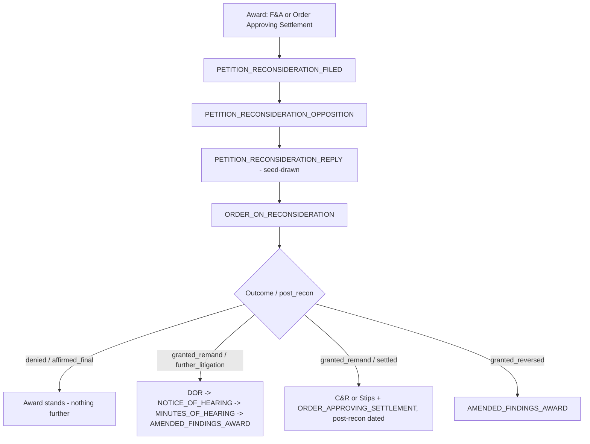

# wc-synthetic-caseload-engine

**Seed-driven generator of complete synthetic California workers' compensation attorney case files.**

Write a small YAML seed per case — who was hurt, how, how far the case went, which
doctrines flavour it, exactly which documents in what quantities and formats — run one
command, and get back case files that read like an applicant-side firm produced them:
through lien conferences and executed lien agreements, through a petition for
reconsideration that came back remanded and settled on remand.

The same seed regenerates the same caseload forever, byte for byte.

```bash
wc-caseload generate --spec examples/demo-caseload.yaml --out /tmp/wcce-demo
wc-caseload validate --out /tmp/wcce-demo
```

---

## Why this exists

Adjudica demo accounts held five document-free matters and one hand-populated case. The
closest existing tool, `merus-test-data-generator`, generates documents at scale but takes
only CLI flags — no per-case seed artifact, no reconsideration round-trips, thin lien
modelling, and no fine-grained per-case document controls. The classifier's accuracy corpus
covered only 97 of 353 subtypes for the same reason: nothing could generate targeted
documents to specification.

This engine adds **control** on top of that substrate, which it consumes as a library and
never copies.

---

## Install

```bash
uv venv --python 3.12
uv pip install -e ".[dev]"
```

The substrate (`packages/merus-test-data-generator`) must be checked out alongside this
package. Override discovery with `WC_CASELOAD_SUBSTRATE=/abs/path` if it lives elsewhere.

---

## CLI

| Command | What it does |
|---------|--------------|
| `wc-caseload generate --spec S --out D` | Resolve a caseload, plan every case, render every document, write manifests |
| `wc-caseload generate --spec S --out D --dry-run` | Validate and print the plan; write nothing |
| `wc-caseload generate ... --seed N` | Override `auto.rng_seed` for this run (explicit case seeds untouched) |
| `wc-caseload seed --template [--kind case\|caseload]` | Print an annotated seed covering every controllable field |
| `wc-caseload validate --spec S` | Schema, cross-field rules and document-control key validity |
| `wc-caseload validate --out D` | Every manifest subtype canonical + parent-valid, every file present, every MD5 matching |
| `wc-caseload taxonomy-check` | Diff the engine taxonomy against the classifier source; nonzero exit on drift |

Generation never touches the network and never writes outside `--out`.

---

## Seed schema

One case is one `CaseSeed`. Every field except `case_id`, `rng_seed` and `injury` has a
default, and anything omitted is derived deterministically from `rng_seed`.

```yaml
case_id: martinez-001          # also the output directory name
rng_seed: 12345                # fully determines the case
profile:                       # all optional — derived when omitted
  applicant: {name, age, occupation, tenure_years}
  employer:  {name, industry, county}
  carrier:   {name}
  attorneys: {applicant_firm, defense_firm}
  physicians: {ptp_specialty, qme_specialty}
injury:
  type: specific | cumulative_trauma | death
  date_of_injury: 2023-04-12   # or ct_start + ct_end for cumulative trauma
  body_parts:                  # 1..5
    - {part: lumbar_spine, icd10: M54.5, detail: "L4-L5 disc protrusion"}
  mechanism: auto | <free text>
lifecycle:
  target_stage: intake | active_treatment | discovery | medical_legal | pre_trial | resolved | post_recon
  claim_response: accepted | delayed | denied
  eval_type: qme | ame | none
  ur_dispute:
    enabled: bool
    decision: upheld | overturned     # "upheld" = the UR denial stands
    imr: bool
    imr_outcome: upheld | overturned
  resolution:
    type: stipulations | c_and_r | findings_award | take_nothing | pending
    msa: bool
  reconsideration:
    enabled: bool
    outcome: denied | granted_remand | granted_reversed
    post_recon: further_litigation | settled | affirmed_final
  liens:
    count: 0..8
    claimants: [medical_provider | hospital | pharmacy | ambulance | edd | attorney_costs | self_procured]
    resolution: lien_stipulation | lien_resolution_agreement | dismissal | order_on_lien | mixed | pending
    post_resolution_litigation: bool
  doctrine_hooks: []           # ogilvie, almaraz_guzman, benson, escobedo, kite,
                               # going_and_coming, sibtf, death_dependency, lc3208_3_psych,
                               # gfpa, firefighter_presumption, imr_constitutionality,
                               # ab5_dynamex, lc4664_prior_award
documents:
  global_cap: 120
  format_mix: {pdf: 0.6, scanned_pdf: 0.25, eml: 0.1, docx: 0.05}
  include_only: []             # subtype keys and/or parent type keys
  exclude: []
  overrides:
    - {subtype: DEPOSITION_TRANSCRIPT, count: 2}
    - {type: MEDICAL_CLINICAL, min: 8, max: 25}
output:
  filename_style: neutral | corpus
  formats: [pdf, scanned_pdf, eml, docx]
```

Unknown fields and invalid enum values are rejected with the dotted field path, the allowed
values and the offending input — a typo never silently generates the wrong caseload.

### Caseload spec

```yaml
caseload_id: demo-2026q3
defaults: {<partial CaseSeed>}   # deep-merged *under* each case
cases: [<CaseSeed>, ...]
auto: {count: 20, distribution: balanced, rng_seed: 777}
```

Distributions: `balanced` (mirrors the KB PRD attorney caseload), `early_stage`,
`settlement_heavy`, `complex_litigation`. **Auto-derived seeds are always materialized** to
`<out>/<case_id>/seed.yaml` — the seed is the surfaced contract, never an implicit one.

---

## Document control precedence

Highest wins:

1. **Per-subtype override** — `{subtype: X, count: N}` emits exactly `N`, even if the
   lifecycle never proposed it and even if a blacklist or the cap says otherwise. Forcing a
   lifecycle-invalid subtype works and logs a WARN: explicit control wins, loudly.
2. **`include_only` / `exclude`** — whitelist then blacklist, matching a subtype key or a
   parent type key.
3. **Per-type `min`/`max`** — bounds the surviving total for a parent type.
4. **Lifecycle emission defaults** — what the machines proposed.
5. **`global_cap`** — trims last, taking the most-trimmable first (filler, then supporting,
   then core; within a track the highest `priority` number goes first). Never trims a
   per-subtype override and never pushes a type below its `min`.

Counts are resolved without dates, then dates are re-attached from the proposing candidate;
copies beyond what the lifecycle proposed continue the same date series deterministically.

---

## Lifecycle paths

### Core



### Liens — one track per claimant



Claimant type maps to its claim subtype: `medical_provider` → `LIEN_MEDICAL_PROVIDER`,
`hospital` → `LIEN_HOSPITAL`, `pharmacy` → `LIEN_PHARMACY`, `ambulance` →
`LIEN_AMBULANCE_TRANSPORT`, `edd` → `LIEN_EDD_OVERPAYMENT`, `attorney_costs` →
`LIEN_ATTORNEY_COSTS`, `self_procured` → `LIEN_SELF_PROCUREMENT_MEDICAL`.

`resolution: mixed` picks per track, so one case can settle one lien, stipulate another and
dismiss a third. With `post_resolution_litigation: true` every lien document is dated
**after** the case-in-chief resolution — the common real-world shape where the case settles
and the liens keep fighting.

### Reconsideration round trip



Statutory clocks are enforced and assertable from the manifest: the petition is filed within
**25 days** of the award (LC 5903 — 20 days plus 5 for mail service) and the order issues
within **60 days** of the petition (LC 5909).

A seed that enables reconsideration on an unresolved case has nothing to attack; the engine
emits no recon documents and records a warning naming the fix.

---

## Outputs

```
<out>/<case_id>/
  seed.yaml          the surfaced contract — always materialized, round-trips exactly
  manifest.json
  documents/<files>
<out>/caseload_manifest.json
```

`manifest.json` carries the case facts (`caseId`, `adjNumber`, `applicant`, `employer`,
`carrier`, `dateOfInjury`, `venue`, `judge`, `stage`, `resolution`), a `liens[]` summary, a
`recon{}` summary, a `documents[]` array of
`{filename, subtype, type, format, documentDate, md5Checksum, fileSize, mimeType}`, and a
`provenance` block asserting `zeroRealPii: true` with the generator version and seed hash.

**Filename styles.** `neutral` (default) emits `###_YYYY-MM-DD.ext` and leaks no subtype — a
classifier scored against these files cannot cheat by reading the name. `corpus` emits
`TC-###_###_<SUBTYPE>_<YYYY-MM-DD>.pdf`, matching the classifier's sampling regex
`^(TC-\d{3})_(\d{3})_(.+)_(\d{4}-\d{2}-\d{2})\.pdf$`.

---

## Determinism

Same seed plus same version produces the same bytes, including every MD5 in the manifest.
Manifests carry **no generation timestamp**, precisely so the guarantee stays verifiable.

Three leaks had to be closed, all in substrate output, none by editing the substrate
(see `src/wc_caseload_engine/determinism.py`):

| Leak | Fix |
|------|-----|
| `list(set(items))` in the substrate's content pools — salted string hashing reordered document content per process | The CLI re-executes once with `PYTHONHASHSEED=0`, which stabilizes every set-of-strings ordering at once |
| `.docx` ZIP entries stamped with wall-clock times | Repacked with timestamps derived from the document date |
| ReportLab's wall-clock `/CreationDate` and random `/ID`; PyMuPDF's `/ID` on scanned rewrites | `rl_config.invariant` plus a length-preserving `/ID` rewrite that keeps xref offsets valid |

Scan simulation is seeded explicitly from `sha256(rng_seed, "scan:<index>")` rather than the
substrate's `hash()`-derived seed. Set `WC_CASELOAD_NO_REEXEC=1` to suppress the re-exec when
running under a debugger; determinism across processes is then no longer guaranteed.

Verify it:

```bash
wc-caseload generate --spec examples/demo-caseload.yaml --out /tmp/run-a
wc-caseload generate --spec examples/demo-caseload.yaml --out /tmp/run-b
diff -r /tmp/run-a /tmp/run-b && echo "identical"
```

---

## Example caseload walkthrough

`examples/demo-caseload.yaml` generates six cases, 276 documents, all four formats:

| Case | Shape |
|------|-------|
| `alvarez-denied-recon-remand` | Claim denied, tried to a Findings & Award, petitioned for reconsideration, remanded, settled on remand |
| `nguyen-cr-three-liens` | C&R with three lien claimants taken through executed Lien Resolution Agreements, litigated after the case closed; corpus filenames |
| `okafor-ct-ur-imr` | Cumulative trauma, three body parts, treatment denied at UR and appealed through IMR |
| `ramirez-death-dependency` | Death claim with dependency benefits, resolved by stipulation, one hospital lien |
| `whitfield-early-intake` | A fresh file — intake only, nothing resolved |
| `castellanos-trial-recon-denied` | Tried to decision, petition for reconsideration denied, award stands |

Dates of injury are chosen to leave statutory runway: a case that petitions and then settles
on remand needs roughly nine months after its award before the fixed anchor date
(`2026-01-01`), or the whole post-award sequence compresses into a single day.

---

## Taxonomy

The classifier is the vocabulary of record: **353 subtypes across 15 parent types**. The
substrate enum carries 384 keys — 350 canonical plus 34 local realism subtypes (fax cover
sheets, blank scanned pages, internal file notes). Those 34 are never written to a manifest:
11 map to an unambiguous canonical equivalent and the rest are dropped. A wrong mapping would
silently poison the accuracy corpus this engine exists to feed, so the mapping is deliberately
conservative.

`wc-caseload taxonomy-check` re-parses the classifier TypeScript at runtime and exits nonzero
on any drift.

---

## Development

```bash
.venv/bin/python -m pytest tests/ -q     # 169 tests
.venv/bin/ruff check .
```

Tests never touch the network. Those needing the substrate or the classifier checkout skip
cleanly when it is absent. See `CLAUDE.md` for architecture and substrate-bridge notes.

---

@Developed & Documented by Glass Box Solutions, Inc. using human ingenuity and modern technology
