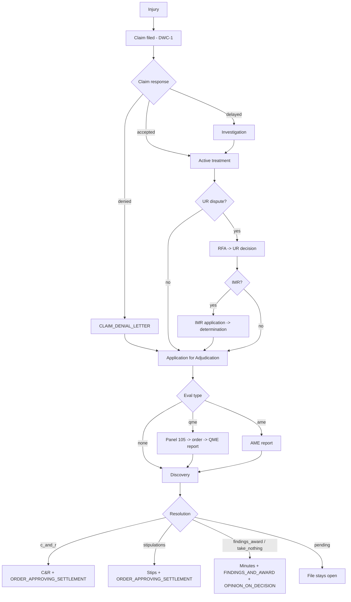
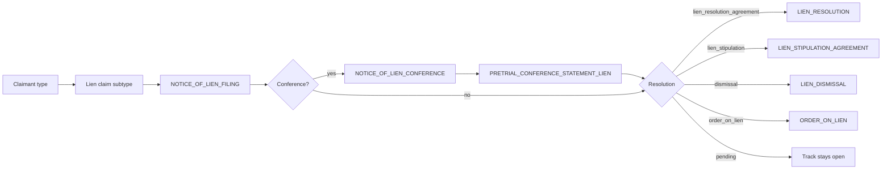
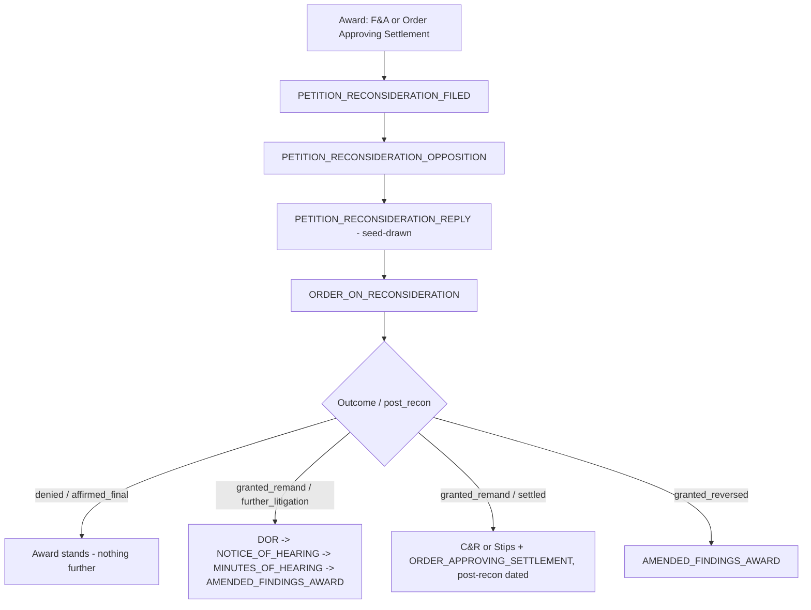

# wc-synthetic-caseload-engine

**Seed-driven generator of complete synthetic California workers' compensation attorney case files.**

Write a small YAML seed per case — who was hurt, how, how far the case went, which
doctrines flavour it, exactly which documents in what quantities and formats — run one
command, and get back case files that read like an applicant-side firm produced them:
through lien conferences and executed lien agreements, through a petition for
reconsideration that came back remanded and settled on remand.

The same seed regenerates the same caseload forever, byte for byte.

```bash
wc-caseload generate --spec examples/demo-caseload.yaml --out /tmp/wcce-demo
wc-caseload validate --out /tmp/wcce-demo
```

---

## Why this exists

Adjudica demo accounts held five document-free matters and one hand-populated case. The
closest existing tool, `merus-test-data-generator`, generates documents at scale but takes
only CLI flags — no per-case seed artifact, no reconsideration round-trips, thin lien
modelling, and no fine-grained per-case document controls. The classifier's accuracy corpus
covered only 97 of 353 subtypes for the same reason: nothing could generate targeted
documents to specification.

This engine adds **control** on top of that substrate, which it consumes as a library and
never copies.

---

## Install

```bash
uv venv --python 3.12
uv pip install -e ".[dev]"
```

The substrate (`packages/merus-test-data-generator`) must be checked out alongside this
package. Override discovery with `WC_CASELOAD_SUBSTRATE=/abs/path` if it lives elsewhere.

---

## CLI

| Command | What it does |
|---------|--------------|
| `wc-caseload generate --spec S --out D` | Resolve a caseload, plan every case, render every document, write manifests |
| `wc-caseload generate --spec S --out D --dry-run` | Validate and print the plan; write nothing |
| `wc-caseload generate ... --seed N` | Override `auto.rng_seed` for this run (explicit case seeds untouched) |
| `wc-caseload seed --template [--kind case\|caseload]` | Print an annotated seed covering every controllable field |
| `wc-caseload validate --spec S` | Schema, cross-field rules and document-control key validity |
| `wc-caseload validate --out D` | Every manifest subtype canonical + parent-valid, every file present, every MD5 matching, every document rendered by its own template (`--allow-fallback` to permit fallbacks) |
| `wc-caseload taxonomy-check` | Diff the engine taxonomy against the classifier source; nonzero exit on drift |

Generation never touches the network and never writes outside `--out`.

---

## Seed schema

One case is one `CaseSeed`. Every field except `case_id`, `rng_seed` and `injury` has a
default, and anything omitted is derived deterministically from `rng_seed`.

```yaml
case_id: martinez-001          # also the output directory name
rng_seed: 12345                # fully determines the case
perspective: applicant         # applicant | defense — whose file this is
profile:                       # all optional — derived when omitted
  applicant: {name, age, occupation, tenure_years}
  employer:  {name, industry, county}
  carrier:   {name}
  attorneys: {applicant_firm, defense_firm}
  physicians: {ptp_specialty, qme_specialty}
injury:
  type: specific | cumulative_trauma | death
  date_of_injury: 2023-04-12   # or ct_start + ct_end for cumulative trauma
  body_parts:                  # 1..5
    - {part: lumbar_spine, icd10: M54.5, detail: "L4-L5 disc protrusion"}
  mechanism: auto | <free text>
lifecycle:
  target_stage: intake | active_treatment | discovery | medical_legal | pre_trial | resolved | post_recon
  claim_response: accepted | delayed | denied
  eval_type: qme | ame | none
  ur_dispute:
    enabled: bool
    decision: upheld | overturned     # "upheld" = the UR denial stands
    imr: bool
    imr_outcome: upheld | overturned
  resolution:
    type: stipulations | c_and_r | findings_award | take_nothing | pending
    msa: bool
  reconsideration:
    enabled: bool
    outcome: denied | granted_remand | granted_reversed
    post_recon: further_litigation | settled | affirmed_final
  liens:
    count: 0..8
    claimants: [medical_provider | hospital | pharmacy | ambulance | edd | attorney_costs | self_procured]
    resolution: lien_stipulation | lien_resolution_agreement | dismissal | order_on_lien | mixed | pending
    post_resolution_litigation: bool
  doctrine_hooks: []           # ogilvie, almaraz_guzman, benson, escobedo, kite,
                               # going_and_coming, sibtf, death_dependency, lc3208_3_psych,
                               # gfpa, firefighter_presumption, imr_constitutionality,
                               # ab5_dynamex, lc4664_prior_award
                               # -> each injects citation + argument into matching
                               #    subtypes; see "Doctrine hooks" below
documents:
  global_cap: 120
  format_mix: {pdf: 0.6, scanned_pdf: 0.25, eml: 0.1, docx: 0.05}
  include_only: []             # subtype keys and/or parent type keys
  exclude: []
  overrides:
    - {subtype: DEPOSITION_TRANSCRIPT, count: 2}
    - {type: MEDICAL_CLINICAL, min: 8, max: 25}
output:
  filename_style: neutral | corpus
  formats: [pdf, scanned_pdf, eml, docx]
```

Unknown fields and invalid enum values are rejected with the dotted field path, the allowed
values and the offending input — a typo never silently generates the wrong caseload.

### Caseload spec

```yaml
caseload_id: demo-2026q3
defaults: {<partial CaseSeed>}   # deep-merged *under* each case
cases: [<CaseSeed>, ...]
auto: {count: 20, distribution: balanced, rng_seed: 777}
```

Distributions: `balanced` (mirrors the KB PRD attorney caseload), `early_stage`,
`settlement_heavy`, `complex_litigation`. **Auto-derived seeds are always materialized** to
`<out>/<case_id>/seed.yaml` — the seed is the surfaced contract, never an implicit one.

---

## Document control precedence

Highest wins:

1. **Per-subtype override** — `{subtype: X, count: N}` emits exactly `N`, even if the
   lifecycle never proposed it and even if a blacklist or the cap says otherwise. Forcing a
   lifecycle-invalid subtype works and logs a WARN: explicit control wins, loudly.
2. **`include_only` / `exclude`** — whitelist then blacklist, matching a subtype key or a
   parent type key.
3. **Per-type `min`/`max`** — bounds the surviving total for a parent type.
4. **Lifecycle emission defaults** — what the machines proposed.
5. **`global_cap`** — trims last, taking the most-trimmable first (filler, then supporting,
   then core; within a track the highest `priority` number goes first). Never trims a
   per-subtype override and never pushes a type below its `min`.

Counts are resolved without dates, then dates are re-attached from the proposing candidate;
copies beyond what the lifecycle proposed continue the same date series deterministically.

---

## Perspective — whose file is this

One injury, two case files. The applicant firm's folder and the defense firm's folder describe
the same claim and share most of their paper, but the privileged half of each is written by a
different lawyer for a different client. `perspective` picks which folder you are generating.

```yaml
perspective: applicant   # the default
perspective: defense
```

**It never changes a case fact.** Same `rng_seed`, same everything else: identical cast (both
firms exist in both files — they are opposing counsel, not alternatives), identical ADJ number,
identical date of injury, identical lifecycle event dates. Only the file's point of view moves.
That is enforced structurally rather than by convention — `perspective` is never mixed into an
RNG salt that feeds a fact, and on the applicant path the whole module is an identity function
that draws no randomness at all. Which is also why every seed written before this field existed
plans, dates and renders exactly as it did.

Three things change, all of them in `perspective.py`:

**1. Work product swaps.** Privileged analysis belongs to whoever owns the file.

| Applicant file | Defense file |
|---|---|
| `CASE_ANALYSIS_MEMO` | `DEFENSE_CASE_ANALYSIS` |
| `SETTLEMENT_VALUATION_MEMO` | `DEFENSE_MSC_STATEMENT` |
| `TRIAL_BRIEF` | `DEFENSE_TRIAL_BRIEF` |

All six are canonical `WORK_PRODUCT` keys, so the swap is a rename and never a taxonomy escape.
Work product both sides prepare under the same name — `MEDICAL_CHRONOLOGY_TIMELINE`,
`DEPOSITION_SUMMARY` — deliberately does not swap.

**2. Emission profiles.** `PERSPECTIVE_PROFILES` maps a subtype *or* a parent type to
`{applicant_weight, defense_weight}`, multipliers on what the shared lifecycle proposed. A
subtype row beats its type's row; a key with no row is carried unchanged by both files. **Tuning
is one edit to that table.**

| Key | Applicant | Defense | Why |
|---|---|---|---|
| `CLIENT_CORRESPONDENCE_INFORMATIONAL` / `_REQUEST` | 1.0 | 1.0 | Both firms write to their own client; only the roles invert |
| `CLIENT_INTAKE_CORRESPONDENCE` | 1.0 | 0.0 | Defense counsel is assigned by a carrier; it runs no intake |
| `CLIENT_STATUS_LETTERS` | 1.0 | 0.0 | Status letters go to an injured worker |
| `ADVOCACY_LETTERS_*` (PTP/QME/AME) | 1.0 | 0.0 | Lobbying a physician toward a finding is applicant-side practice |
| `SETTLEMENT_DEMAND_LETTER` | 1.0 | 1.0 | Applicant-authored; the defense file holds it as *received* mail |
| `CLAIMS_ADMINISTRATION` (type) | 1.0 | 2.5 | The carrier's own claim file — reserves, diary notes, nurse case management |
| `INVESTIGATION` (type) | 1.0 | 3.0 + floor | Sub-rosa surveillance and social-media workups are defense-retained |

`INVESTIGATION` is the one case a multiplier cannot express alone: the shared lifecycle proposes
*zero* investigator reports, and any multiple of zero is zero. So a row may name a **floor** —
subtypes planted once each when the characteristic side's pool is otherwise empty. Defense files
get `INVESTIGATOR_REPORT`, `SURVEILLANCE_VIDEO` and `SOCIAL_MEDIA_EVIDENCE`. "Characteristic
side" is whichever weight is strictly higher; equal weights plant nothing.

**Perspective is a default, not a veto.** An explicit `documents.overrides` entry still forces
applicant-only paper into a defense file, through the same forced-emission path as any other
lifecycle-invalid override (see *Document control precedence*), with a WARN that names the
perspective as what it is overruling.

**3. Roles.** "Client" means the injured worker on an applicant file and the employer/carrier on
a defense file, so the author and recipient of client correspondence invert. Documents the file
owner authors (work product, client correspondence) get the owner's attorney as author and the
owner's client as recipient; everything else keeps the author the facts give it — an Application
for Adjudication is applicant-filed in *both* files, an order is the judge's in both — and is
addressed to the firm that owns the file, which is what makes it *received* paper. Roles reach
the templates through the render context alongside `perspective` and `file_owner_firm`.

### Known limitation: defense letterhead

The substrate hard-codes `Martinez & Associates, APC` on the docx letterhead
(`data/docx_styles.py`), so **`.docx` files in a defense case file carry the applicant firm's
letterhead**. This is the same limitation already documented for `profile.attorneys.
applicant_firm`, now with a second visible symptom. It is not worked around for the same reason:
patching a substrate module's private constant at runtime is shared mutable state across cases,
and this package consumes the substrate as a library rather than editing it. The proper fix is an
injectable firm identity upstream.

Scope of the defect: the rendered docx letterhead only. The manifest, the seed, the subtype set,
the roles and every other format are unaffected — `manifest.json` records
`perspective: defense` and the correct `applicantFirm` / `defenseFirm` regardless.

---

## Lifecycle paths

### Core



### Liens — one track per claimant



Claimant type maps to its claim subtype: `medical_provider` → `LIEN_MEDICAL_PROVIDER`,
`hospital` → `LIEN_HOSPITAL`, `pharmacy` → `LIEN_PHARMACY`, `ambulance` →
`LIEN_AMBULANCE_TRANSPORT`, `edd` → `LIEN_EDD_OVERPAYMENT`, `attorney_costs` →
`LIEN_ATTORNEY_COSTS`, `self_procured` → `LIEN_SELF_PROCUREMENT_MEDICAL`.

`resolution: mixed` picks per track, so one case can settle one lien, stipulate another and
dismiss a third. With `post_resolution_litigation: true` every lien document is dated
**after** the case-in-chief resolution — the common real-world shape where the case settles
and the liens keep fighting.

### Reconsideration round trip



Statutory clocks are enforced and assertable from the manifest: the petition is filed within
**25 days** of the award (LC 5903 — 20 days plus 5 for mail service) and the order issues
within **60 days** of the petition (LC 5909).

A seed that enables reconsideration on an unresolved case has nothing to attack; the engine
emits no recon documents and records a warning naming the fix.

---

## Doctrine hooks — landmark authorities, in the paper

`lifecycle.doctrine_hooks` names the doctrines a file turns on. Each hook does three things:

1. **Shapes the case.** `lc3208_3_psych` forces the psych component; two or more hooks raise
   the substrate's clinical complexity from `standard` to `complex`. Both predate content
   injection, and the second is worth knowing about: because complexity feeds the whole case,
   a two-hook seed produces different clinical content in *every* document, including
   documents no doctrine targets.
2. **Lands in the manifest.** `doctrineHooks` at case level; `contentFlags` per document, and
   only on documents that actually carry the language (a hook-free caseload's manifests are
   byte-identical to what they were before this existed).
3. **Injects language.** Every hook carries a controlling-authority citation and two pools of
   paragraphs — one in the register of a med-legal evaluator's discussion, one in the register
   of points and authorities. Which pool a document draws from is decided by that document's
   own subtype.

The content table lives in `src/wc_caseload_engine/doctrine.py`. Each hook declares a
**marker**: a short string chosen to survive PDF text extraction, so a generated corpus can be
verified — or sampled by a classifier consumer — with a grep rather than a parser.

| Hook | Marker | Controlling authority | Example targets (medical / legal) |
|------|--------|----------------------|-----------------------------------|
| `ogilvie` | `Ogilvie` | Ogilvie v. WCAB (2011) 197 Cal.App.4th 1262 | `VOCATIONAL_EXPERT_REPORT` / `TRIAL_BRIEF` |
| `almaraz_guzman` | `Guzman` | Milpitas Unified School Dist. v. WCAB (Guzman) (2010) 187 Cal.App.4th 808 | `QME_COMPREHENSIVE_REPORT` / `PD_RATING_CALCULATION_WORKSHEET` |
| `benson` | `Benson` | Benson v. WCAB (2009) 170 Cal.App.4th 1535 | `APPORTIONMENT_REPORT` / `MOTION_TO_CONSOLIDATE` |
| `escobedo` | `Escobedo` | Escobedo v. Marshalls (2005) 70 Cal.Comp.Cases 604 (en banc) | `APPORTIONMENT_REPORT` / `APPORTIONMENT_WORKSHEET` |
| `kite` | `Kite` | Athens Administrators v. WCAB (Kite) (2013) 78 Cal.Comp.Cases 213 (writ den.) | `IMPAIRMENT_RATING_WORKSHEET` / `PD_RATING_CONVERSION` |
| `going_and_coming` | `going and coming` | Hinojosa v. WCAB (1972) 8 Cal.3d 150 | `QME_COMPREHENSIVE_REPORT` / `CLAIM_DENIAL_LETTER` |
| `sibtf` | `4751` | Labor Code § 4751 | `IMPAIRMENT_RATING_WORKSHEET` / `MOTION_FOR_JOINDER` |
| `death_dependency` | `3501` | Labor Code §§ 3501–3503, 4702 | `AME_COMPREHENSIVE_REPORT` / `APPLICATION_FOR_ADJUDICATION_DEATH` |
| `lc3208_3_psych` | `3208.3` | Labor Code § 3208.3 | `PSYCH_EVAL_REPORT_QME_AME` / `ANSWER_TO_APPLICATION` |
| `gfpa` | `personnel action` | Labor Code § 3208.3(h) | `PSYCH_EVAL_REPORT_QME_AME` / `DEFENSE_CASE_ANALYSIS` |
| `firefighter_presumption` | `3212.1` | Labor Code § 3212.1 | `MEDICAL_LEGAL_QME_AME_IME` / `COMPENSABILITY_DETERMINATION` |
| `imr_constitutionality` | `Stevens` | Stevens v. WCAB (2015) 241 Cal.App.4th 1074; Ramirez v. WCAB (2017) 10 Cal.App.5th 205 | `AME_COMPREHENSIVE_REPORT` / `IMR_DETERMINATION_FORM` |
| `ab5_dynamex` | `Dynamex` | Dynamex Operations West, Inc. v. Superior Court (2018) 4 Cal.5th 903; LC § 2775 | `QME_COMPREHENSIVE_REPORT` / `ANSWER_TO_APPLICATION` |
| `lc4664_prior_award` | `4664` | Labor Code § 4664(b) | `APPORTIONMENT_REPORT` / `APPORTIONMENT_WORKSHEET` |

The full target sets are in `DOCTRINE_CONTENT`; 36 canonical subtypes are targeted in all, and
`tests/test_doctrine_content.py` asserts every one of them against the 353-key taxonomy.

### Honest limits

**The section is appended, not interleaved.** A flagged document gets its doctrine content as a
trailing section — `ADDENDUM — MEDICAL-LEGAL DISCUSSION OF CONTROLLING AUTHORITY` on a medical
target, `POINTS AND AUTHORITIES — CONTROLLING DOCTRINE` on a legal one — after everything the
substrate template produced. A real QME would weave the Guzman analysis through the impairment
discussion rather than bolting it to the end. Interleaving would mean editing substrate
templates, which this package does not do (the substrate is consumed as a read-only library and
an anti-probe enforces it). What the addendum does guarantee is that the language is *present,
attributable and locatable*, which is what a classifier corpus needs; what it does not claim is
that the document reads exactly as a practitioner would have drafted it.

**Scanned PDFs carry the section but yield no text.** A `scanned_pdf` is a raster of the same
story, so the doctrine content is in the image and not extractable — the same blind spot every
text probe in this suite has, and the reason the render assertions use native pdf.

**Case citations are the one place real names appear.** Everything else in a generated file is
coined or Faker-drawn and swept against a denylist; an authority is named by its case name or it
is not a citation. Those surnames are checked against the denylist and the substrate's live
organization pools, but they can still collide with a *seeded* applicant surname — the demo
caseload already has a `Ramirez`. A collision is cosmetic rather than a leak, and the cross-case
sweep in `tests/test_coherence.py` is what would surface it.

---

## Outputs

```
<out>/<case_id>/
  seed.yaml          the surfaced contract — always materialized, round-trips exactly
  manifest.json
  documents/<files>
<out>/caseload_manifest.json
```

`manifest.json` carries the case facts (`caseId`, `adjNumber`, `applicant`, `employer`,
`carrier`, `dateOfInjury`, `venue`, `judge`, `stage`, `resolution`), a `liens[]` summary, a
`recon{}` summary, a `documents[]` array of
`{filename, subtype, type, format, documentDate, md5Checksum, fileSize, mimeType, template,
fallback}`, and a `provenance` block carrying a computed `zeroRealPii`, its `castProvenance`
derivation, the generator version, the seed hash and `substrateSha`.

A document that carries doctrine language gains one more field, `contentFlags` — the hooks
whose paragraphs are in it (see [Doctrine hooks](#doctrine-hooks--landmark-authorities-in-the-paper)).
It is written only when non-empty, so a caseload that seeds no doctrines produces exactly the
manifests it produced before the field existed.

**`template` and `fallback`.** `template` names the class and variant that produced the file
(`CourtNotice/lien_filing`); `fallback` is `true` when the document did not render as
dispatched — the requested format failed, or the subtype had no template and fell through to
`GenericDocumentTemplate`. The substrate's registry returns the generic template for keys it
does not recognise, so without these two fields a caseload whose dispatch had silently
degraded is indistinguishable from one that had not. `validate --out` fails on any
`fallback: true` unless `--allow-fallback` is passed, because a document rendered by the wrong
template is mislabelled classifier training data.

**`provenance.zeroRealPii` is computed, not asserted.** It is derived from
`castProvenance`, which records where each identity-bearing field came from: `faker` (drawn
from the seeded generator), `seed` (declared in the YAML) or `engine` (coined here to replace
a substrate constant naming a real company). A flag that no input can falsify says nothing;
this one goes false the moment an identity arrives by a channel the engine cannot vouch for.

**Real organizations never reach a document.** `data/wc_constants.py` has **four** pools that
name organizations, and all four reach the cast:

| Substrate pool | Reaches | Real entities it contains |
|---|---|---|
| `INSURANCE_CARRIERS` | `carrier` | State Fund, Zenith, Liberty Mutual, Sedgwick |
| `DEFENSE_FIRMS` | `defenseFirm` | Bradford & Barthel, Laughlin Falbo, Hanna Brophy |
| `ALL_EMPLOYERS` | `employer` | Safeway, Costco, Kaiser Permanente, UPS, City of Los Angeles |
| `MEDICAL_FACILITIES` | treating / QME / prior-provider clinics | clinic names |

A fabricated claim file naming a real employer is worse than one naming a real carrier — the
employer is a *named defendant* in the caption of every legal document in the file. The engine
substitutes seed-stable coined names on every one of these paths and rebuilds the derived
adjuster and defense email addresses, which otherwise kept the original company's domain.

Two layers keep it that way, and the second is the one that cannot go stale:

* `src/wc_caseload_engine/data/name_denylist.txt` — a curated list of real bodies, swept
  against every text-bearing demo document and every manifest cast field. Shipped as package
  data because the engine reads it too.
* `name_denylist.substrate_organization_pools()` — reads the substrate's pools **live**, so a
  pool that grows upstream is swept without anyone editing a fixture. A renamed constant
  raises rather than silently sweeping nothing.

**Seed-declared names are kept, and warned about.** A name the seed author wrote is the
seeder's deliberate input and the seed is the contract, so the engine does not override it —
but it checks it against the denylist and emits a `cast.seed_name_on_denylist` warning on a
hit. `castProvenance` already records the field as `seed` rather than `engine`, so a reviewer
can see whose choice it was.

**The coined employer stays coherent with its industry.** The substrate draws
`(industry, company, position)` as one pool row, so replacing only the company would leave a
Sheriff's Deputy at a coined retail chain. The coined suffix is therefore chosen from the
industry's own family, and `profile.employer.industry` is applied *before* that choice is made
— along with a position re-drawn from the seeded industry's titles — so a seed that names an
industry gets an employer name, a department and a job title that agree. Naming
`profile.applicant.occupation` outranks the re-draw; naming an industry the substrate has no
titles for keeps the substrate's position and falls through to the neutral suffix pool.

**`provenance.substrateSha`.** Every document's content ultimately comes from the substrate's
templates and content pools, so "same seed, same version" is only half the provenance story —
a manifest that does not name the substrate cannot be reproduced from itself. The recorded
value is the last commit that touched `packages/merus-test-data-generator` (not the monorepo
`HEAD`, which moves on every unrelated commit), or `unknown` outside a git checkout.
`substrate_pin.txt` records the commit the determinism gates were last verified against;
generating against anything else logs a WARN and never fails, because deliberately moving to a
newer substrate is normal and only the operator can tell deliberate from accidental.

**Synthetic-data markers.** Every emitted file says what it is: PDFs carry
`SYNTHETIC TEST DATA — wc-synthetic-caseload-engine` in `/Subject` and `/Producer`, `.docx`
files in `core_properties.comments`, `.eml` files in an `X-Synthetic-Data: true` header. All
are applied *before* the manifest checksum is taken, so a marker can never invalidate a
recorded MD5. These are metadata-only: a visible page watermark would have to come from the
substrate's page templates, which this package does not edit.

**`caseload_manifest.json` → `subtypeCoverage`.** `{distinctSubtypesEmitted, totalCanonical,
percent}`. The engine's *vocabulary* is the classifier's 353 subtypes; what any given caseload
*emits* is whatever its seeds' lifecycles call for — a few dozen for the six-case demo. The
field exists so "353-subtype taxonomy" is never read as "emits all 353"; the gap is the
backlog of subtypes still needing targeted seeds.

**Filename styles.** `neutral` (default) emits `###_YYYY-MM-DD.ext` and leaks no subtype — a
classifier scored against these files cannot cheat by reading the name. `corpus` emits
`TC-###_###_<SUBTYPE>_<YYYY-MM-DD>.pdf`, matching the classifier's sampling regex
`^(TC-\d{3})_(\d{3})_(.+)_(\d{4}-\d{2}-\d{2})\.pdf$`.

---

## Determinism

Same seed plus same version produces the same bytes — **on any machine, in any timezone, on any
day** — including every MD5 in the manifest. Manifests carry **no generation timestamp**,
precisely so the guarantee stays verifiable.

Six leaks had to be closed, all in substrate or library output, none by editing the substrate
(see `src/wc_caseload_engine/determinism.py`):

| Leak | Fix |
|------|-----|
| `list(set(items))` in the substrate's content pools — salted string hashing reordered document content per process | The CLI re-executes once with `PYTHONHASHSEED=0`, which stabilizes every set-of-strings ordering at once. **Only `0` is accepted**: `1`, `2` and `random` are all valid settings that leave hashing salted, so each produces a different caseload from one seed. No environment variable waives that check — the re-exec sentinel `WC_CASELOAD_HASH_PINNED` is a hop counter (capped at 2, hard error past it), never a declaration that hashing is already stable |
| `.docx` ZIP entries stamped with wall-clock times | Repacked with a stamp built from the document date's own fields — never via `localtime`/`mktime` |
| ReportLab's wall-clock `/CreationDate` and random `/ID`; PyMuPDF's `/ID` on scanned rewrites | `rl_config.invariant` (a fixed `gmtime` epoch, so the date string carries an explicit `+00'00'`) plus a length-preserving `/ID` rewrite that keeps xref offsets valid |
| Four substrate sites compute document *content* from `date.today()` — applicant age, years employed, deponent age, a settlement-memo age line | `pin_substrate_clock()` rebinds those names to `ANCHOR_DATE` |
| `.eml` `Date:` headers built with `datetime(...).timestamp()`, which resolves a naive datetime in the **local** zone | `normalize_eml()` rewrites the header from the document date at noon UTC |
| Faker's `date_of_birth` draws from a window ending at `datetime.now()` — a seeded Faker still moved with the clock | The applicant's date of birth is owned in `case_context.py` and derived from `seed.rng("dob")` against the anchor |

The last three were found by running the demo caseload under `TZ=Australia/Sydney`: 55 of 289
files differed from the same command under UTC. Same-machine determinism was real;
cross-machine determinism was not, and the tree would equally have drifted from one day to the
next.

Scan simulation is seeded explicitly from `sha256(rng_seed, "scan:<index>")` rather than the
substrate's `hash()`-derived seed.

### Where the tool writes

`--out` is the entire write surface. Two things had to be true for that to be a guarantee
rather than a habit: nothing may write into `$HOME`, `$TMPDIR` or the working directory
(checked by a sandboxed-environment probe), and importing the substrate may not scatter
`__pycache__` directories through a dependency's source tree. `sys.dont_write_bytecode` is set
on the first executable line of `wc_caseload_engine/__init__.py`, and
`PYTHONDONTWRITEBYTECODE=1` is carried through the hash-seed re-exec.

One file is outside that reach: CPython writes `__init__`'s own bytecode while compiling the
file, before its first line runs. That is an interpreter floor, and the anti-probe names it
explicitly rather than exempting a directory — any other bytecode file fails the test.

**Library-mode caveat.** The `PYTHONHASHSEED=0` pin is applied by re-executing the process,
and only the CLI entry point does that (`wc-caseload …` or `python -m wc_caseload_engine …`).
Importing this package as a library skips it, so a library consumer **must** either call
`wc_caseload_engine.determinism.ensure_stable_hashing()` before generating anything, or start
the interpreter with `PYTHONHASHSEED=0` already set. Without one of those, output stays
self-consistent within a process but differs between processes. Set `WC_CASELOAD_NO_REEXEC=1`
to suppress the re-exec under a debugger — with the same consequence.

Verify it:

```bash
wc-caseload generate --spec examples/demo-caseload.yaml --out /tmp/run-a
wc-caseload generate --spec examples/demo-caseload.yaml --out /tmp/run-b
diff -r /tmp/run-a /tmp/run-b && echo "identical"

# and across timezones
TZ=Australia/Sydney wc-caseload generate --spec examples/demo-caseload.yaml --out /tmp/run-c
diff -r /tmp/run-a /tmp/run-c && echo "timezone-independent"
```

---

## Statutory runway

A seed states how far its case got; the calendar decides whether that is possible. An
Application follows the injury by two to six months, resolution by another six, a petition for
reconsideration within 25 days of the award, and the WCAB's order within 60 more. A seed whose
injury sits too close to the fixed anchor (`2026-01-01`) cannot hold its own story.

Such a seed is **rejected at load time**, naming the field, the driver, the minimum and the
latest acceptable date:

```
injury.date_of_injury is 2025-06-01, which leaves 214 day(s) before the 2026-01-01 anchor,
but lifecycle.target_stage 'resolved' needs at least 540. Move injury.date_of_injury to
2024-07-10 or earlier, or seed a lifecycle that reaches less far.
```

The floor is the **largest** demand the lifecycle makes, and every branch that produces a dated
document chain makes one:

| Driver | Minimum runway | Why |
|--------|---------------|-----|
| `target_stage: intake` | 30 days | |
| `ur_dispute.enabled` | 65 days | RFA at 60 days + the LC 4610 five-day decision window |
| `claim_response: denied` | 90 days | denial (claim + 30) → Application (+7) → DOR (+60) |
| `ur_dispute.imr` | 120 days | RFA → UR → IMR application → IMR determination |
| `target_stage: active_treatment` / `discovery` | 180 days | |
| `eval_type: qme` / `ame` | 240 days | panel request at 180 days + report at +60 |
| `target_stage: medical_legal` / `pre_trial` | 365 days | |
| `target_stage: resolved`, or any `resolution.type` other than `pending` | 540 days | |
| `target_stage: post_recon`, `reconsideration.enabled`, or `liens.post_resolution_litigation` | 720 days | |

Every branch number is derived from the minimum its own document chain can be drawn at, in
`lifecycle_bridge`, rather than estimated — so a seed that passes validation has room for the
documents it asked for.

This replaced silent clamping, which had absorbed a short runway by pinning over-horizon dates
onto the anchor — producing a case whose petition for reconsideration was dated 80 days
*before* the Application it appealed from, and a 30-day intake seed whose denial letter, the
Application answering it and the Declaration of Readiness advancing it were all dated
2026-01-01. Auto-derived seeds satisfy these floors by construction.

Sequenced chains — each lien track, the reconsideration round trip, the denial response — are
fitted as a whole rather than clamped date by date, so a tight window compresses them **in
order** with strictly increasing dates instead of stacking documents on one day.

### Post-resolution lien tracks run past the anchor, on purpose

A lien track seeded with `post_resolution_litigation: true` is allowed to run past the case
horizon rather than be compressed into it. This is a design decision, not an oversight:
post-resolution lien practice genuinely outlives the case-in-chief — the applicant settles,
the providers keep fighting — and the anchor is an artifact of determinism, not a fact about
the file. Squeezing a five-document lien track into the days between a late settlement and a
fixed anchor is what produced five documents sharing one date.

The extension is strictly opt-in, and the two halves stay separable:

| `liens.post_resolution_litigation` | Track floor | Track ceiling |
|---|---|---|
| `false` (default) | injury date | the case horizon (`2026-01-01`) — **never exceeded** |
| `true` | the day after the resolution | whatever the chain needs |

`test_liens_without_post_resolution_litigation_run_alongside_the_case` asserts the default path
never crosses the horizon, so the extension cannot leak into ordinary cases.

---

## Example caseload walkthrough

`examples/demo-caseload.yaml` generates seven cases, 331 documents, all four formats:

| Case | Shape |
|------|-------|
| `alvarez-denied-recon-remand` | Claim denied, tried to a Findings & Award, petitioned for reconsideration, remanded, settled on remand |
| `nguyen-cr-three-liens` | C&R with three lien claimants taken through executed Lien Resolution Agreements, litigated after the case closed; corpus filenames |
| `okafor-ct-ur-imr` | Cumulative trauma, three body parts, treatment denied at UR and appealed through IMR |
| `ramirez-death-dependency` | Death claim with dependency benefits, resolved by stipulation, one hospital lien |
| `whitfield-early-intake` | A fresh file — intake only, nothing resolved |
| `castellanos-trial-recon-denied` | Tried to decision, petition for reconsideration denied, award stands |
| `whitaker-defense-qme-surveillance` | **The other chair** — a defense file on an accepted claim: disputed QME apportionment, sub-rosa surveillance, C&R. Carries the carrier's reserve worksheets and investigator reports, and no client intake or physician advocacy at all |

Dates of injury are chosen to leave statutory runway: a case that petitions and then settles
on remand needs roughly nine months after its award before the fixed anchor date
(`2026-01-01`), or the whole post-award sequence compresses into a single day.

---

## Taxonomy

The classifier is the vocabulary of record: **353 subtypes across 15 parent types**. The
substrate enum carries 384 keys — 350 canonical plus 34 local realism subtypes (fax cover
sheets, blank scanned pages, internal file notes). Those 34 are never written to a manifest:
11 map to an unambiguous canonical equivalent and the rest are dropped. A wrong mapping would
silently poison the accuracy corpus this engine exists to feed, so the mapping is deliberately
conservative.

`wc-caseload taxonomy-check` re-parses the classifier TypeScript at runtime and exits nonzero
on any drift.

**Vocabulary is not coverage.** 353 is what this engine can *name*, not what a run *emits*. A
caseload emits the subtypes its seeds' lifecycles call for — the six-case demo lands in the
dozens. `caseload_manifest.json` states the ratio in `subtypeCoverage`
(`distinctSubtypesEmitted` / `totalCanonical` / `percent`) so nobody sizing a classifier
accuracy corpus mistakes one for the other. Raising coverage is a matter of writing seeds that
reach the untouched subtypes, which is exactly what the document controls are for.

---

## Development

```bash
.venv/bin/python -m pytest tests/ -q     # 225 tests
.venv/bin/ruff check .
```

Tests never touch the network. Those needing the substrate or the classifier checkout skip
cleanly when it is absent. See `CLAUDE.md` for architecture and substrate-bridge notes.

---

@Developed & Documented by Glass Box Solutions, Inc. using human ingenuity and modern technology
